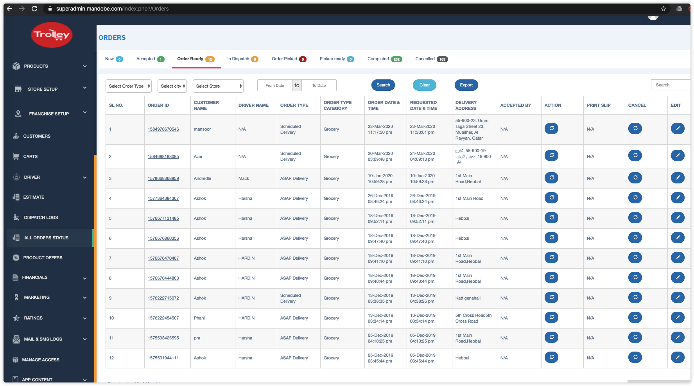
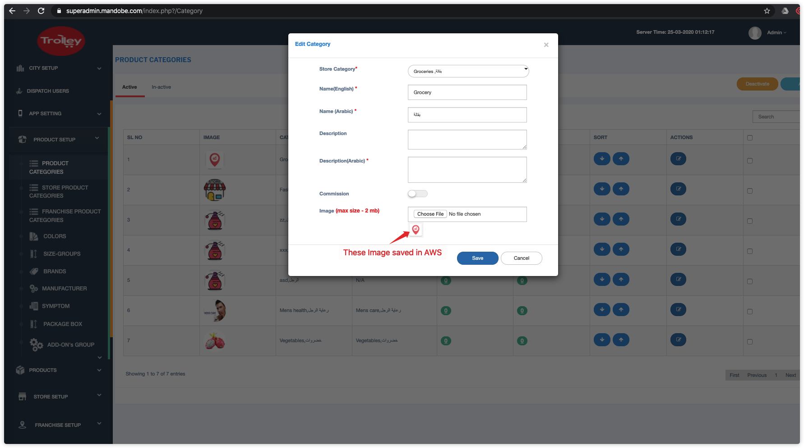
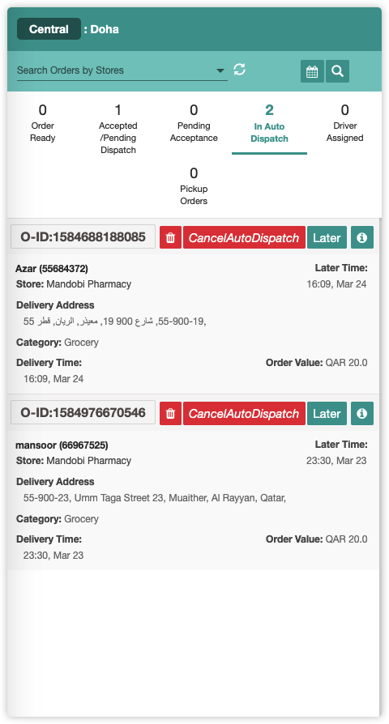

# Trolley Website

This project contains 3 parts.

1. Admin Home Page. Made by Laravel
2. API Endpoint. Made by Node.js
3. Payfort. Payment Integration.


## Admin Home Page



## All Meterials (image, something else) saved in AWS



## API Endpoint




# Task 1. Store Category Background Task

### View Changes

> **Admin/admin/views/StoreCategories/Category.php**

Add BackgroundImage File Tag.

```html

         
```

###Upload to AWS

> **Admin/admin/view/StoreCategories/Category.php**

**Module**: $(":file").on("change", function(e)

```php
$(":file").on("change", function (e) {
  switch ($(this).attr('id'))
      {
        ...
        case "background_image":
          type = 8; //background image
          folderName = 'backgroundImages'
            break; 
      }
    
     $.ajax({
      url: "<?php echo base_url('index.php?/Common') ?>/uploadImagesToAws",
      type: "POST",
      data: form_data,
      dataType: "JSON",
      async: false,
      success: function (result) {       
        switch (type)
        {
          ...
          case 8:
            $('#backgroundImage').val(result.fileName);
            $('.backgroundImage').attr('src', result.fileName);
            $('.backgroundImage').show();
            break;

        }
      },
     
  }
});
```

### Save to DB

> **Admin/admin/view/StoreCategories/Category.php**

```javascript
$('#insert').click(function () {
  var form_data1 = new FormData();
  ...
  form_data1.append('backgroundImage',backgroundimg);
  ...
  $.ajax({
    url: "<?php echo base_url('index.php?/StoreCategoryController/operationCategory') ?>/insert",
    type: 'POST',
    data: form_data1,
    ...
  });
}
```

### API

> **api/web/commonModels/store/categories/get.js**

**Module**: storeCategoryHandler

```javascript
const storeCategoryHandler = (request, reply) => {
   ...
   result[j].backgroundImage = result[j].backgroundImage ? result[j].backgroundImage : "";
```


# Task 2. Add Commission Toggle and Commission Value

##1. Central product category 

###View Changes

> **Admin/admin/Superadmin/application/views/Category/category.php**

Add Commission Toggle Button and Text

```html
<input id="editcommissionCheck"  class="cmn-toggle cmn-toggle-round" type="checkbox" style="display: none;" >
 <label for="editcommissionCheck"></label>
 <br/>
 <div class = "col-sm-6" id="editcommissionText" style="display:none">
 <input type="text" class="form-control error-box" id="editcommission" name="commission"  minlength="3" placeholder="Enter Commission Value" required="">
```

### Controller Changes

> **Admin/admin/Superamin/application/controllers/Category.php**

**Module**: operation

```php
public function operationCategory($param = '', $status = '') {
        switch ($param) {
            case 'insert':$this->StoreLevelCategorymodal->insertCategory();
                break;
            case 'edit': $this->StoreLevelCategorymodal->editCategory();
                break;
```

### Model Changes

> **Admin/admin/Superadmin/application/models/Categorymodal.php**

Add New Fileds: 

- commissionEnable: 0(no), 1(yes)
- commissionValue: commission value (40)

Modules:

- insertCategory():  insert commissionEnable and commissionValue fields
- editCategory(): edit commissionEnable and commissionValue


## 2. Store Product Category 

### View Changes

Edit Store Product

> **Admin/admin/Superadmin/application/views/storeProductCategory/Cagegory/category.php**

Add <div> for toggle button and input value


### Controller Changes

> **Admin/admin/Superadmin/application/controllers/ProductCategory.php**

Module: operationCategory()

```php
public function operationCategory($param = '', $status = '') {
        switch ($param) {
            case 'insert':$this->StoreLevelCategorymodal->insertCategory();
                break;
            case 'edit': $this->StoreLevelCategorymodal->editCategory();
                break;
```

### Model Changes

> **Admin/admin/Superadmin/application/models/StoreLevelCategoryModal.php**

Add New Fileds: 

- commissionEnable: 0(no), 1(yes)

- commissionValue: commission value (40)

  

## 3. Central Product

###View Changes

**Edit/Add Central Product**

> **Admin/admin/Superadmin/application/view/Products/editProducts.php**
>
> **Admin/admin/Superadmin/application/view/Products/AddNewProducts.php**

Add Commission Toggle Button and Text

```html
<input id="editcommissionCheck"  class="cmn-toggle cmn-toggle-round" type="checkbox" style="display: none;" >
 <label for="editcommissionCheck"></label>
 <br/>
 <div class = "col-sm-6" id="editcommissionText" style="display:none">
 <input type="text" class="form-control error-box" id="editcommission" name="commission"  minlength="3" placeholder="Enter Commission Value" required="">
```

### Controller Changes

> **Admin/admin/Superamin/application/controllers/AddNewProducts.php**

Module: operation()

```php
public function operations($operation = '',$id = '') {
  switch ($operation) {

    case 'getCommission':$this->ProductsModel->getCommission();
      break;
    case 'commissionUpdate':$this->ProductsModel->commissionUpdate();
      break;
    case 'commissionEnable':$this->ProductsModel->commissionEnable();
  }
}
```

### Model Changes

> **Admin/admin/Superadmin/application/models/ProductsModel.php**

Add New Fileds: 

- commissionEnable: 0(no), 1(yes)
- commissionValue: commission value (40)

Add New Modules:

- getCommission(): get commissionEnable and commissionVale
- commissionUpdate(): update commissionValue
- commissionEnable(): update commissionEnable


## 4. Store Product

###View Changes

> **Admin/admin/Superadmin/application/view/Products/storeProducts.php**

Add Commission Enable Toggle Button and Commission Value Edit Modal Dialog

```html
<div class="modal fade" id="commissionSettingsPopUp" role="dialog">
```

### Controller Changes

> **Admin/admin/Superamin/application/controllers/AddNewProducts.php**

Module: operation()

```php
public function operations($operation = '',$id = '') {
  switch ($operation) {

    case 'getCommission':$this->ProductsModel->getCommission();
      break;
    case 'commissionUpdate':$this->ProductsModel->commissionUpdate();
      break;
    case 'commissionEnable':$this->ProductsModel->commissionEnable();
  }
}
```

### Model Changes

> **Admin/admin/Superadmin/application/models/ProductsModel.php**

Add New Fileds: 

- commissionEnable: 0(no), 1(yes)
- commissionValue: commission value (40)

Add New Modules:

- getCommission(): get commissionEnable and commissionVale
- commissionUpdate(): update commissionValue
- commissionEnable(): update commissionEnable


# Task3. Added percentage should apply when the booking is completed/cancelled 

### API Endpoint

> **/driver/bookingStatusRide**

### Routes Changes

> **api/web/routes/driver/booking/statusRide/post.js**

Module: chargeCustomer():

Calculate commission value according to product, product category, store commission value

### Model Changes

> **Api/web/commonModels/accounting/accounting.js**

Module: calculate()

Calculate commission value according to product, product category, store commission value


# Task 4. Delay display new order

### View Changes

> **Admin/admin/Superadmin/application/views/app_confi.php**

Add Delay Time Setting input

### Model Changes

> **Admin/admin/Superadmin/application/models/Superadminmodal.php**

Add delayDisplayTime fields to appConfig table

- Module: updateAppConfigNew()

- Update delayDisplayTime value

> **Admin/admin/Superadmin/application/models/OrdersModel.php**

Module: datatableOrders()

- Get delayDisplayTime value from appConfig and display new order to delay

> **api/models/orders/orders.js**

Module: getAllOrders()

- Get delayDisplayTime value from appConfig and display new order to delay


